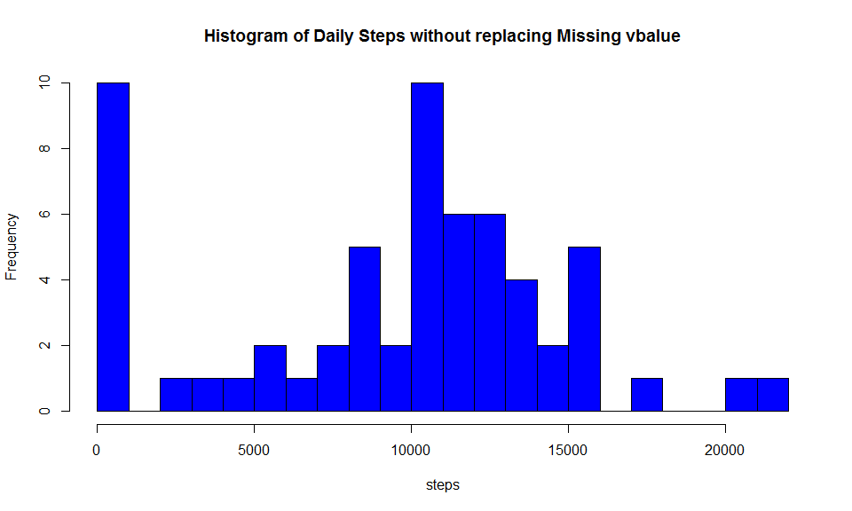
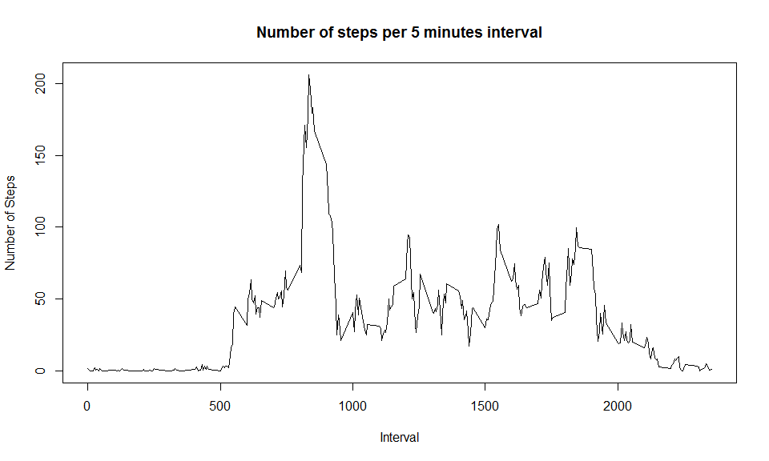
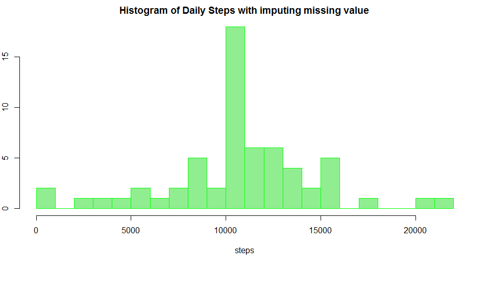
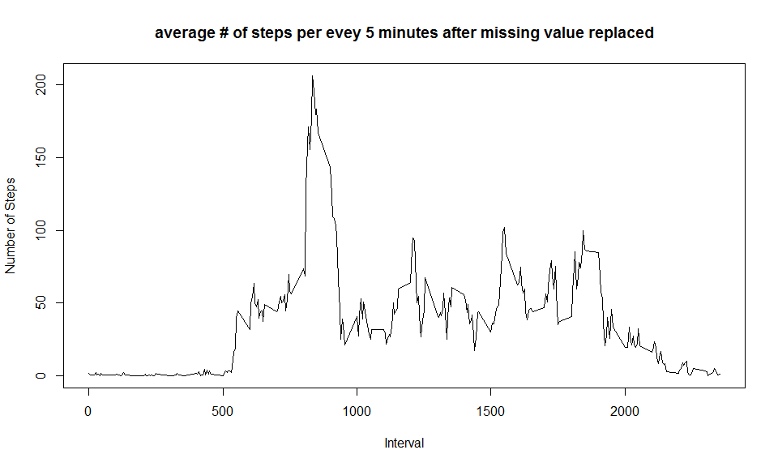
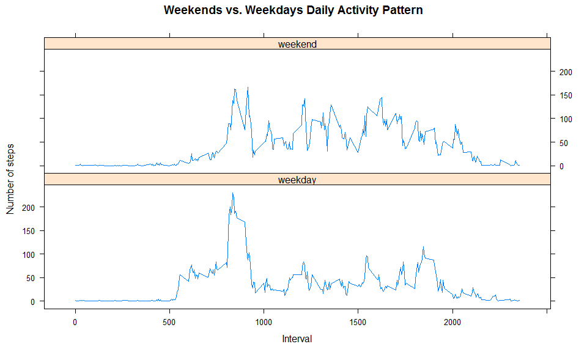

# Reproducible Research: Peer Assessment 1
Thursday, December 11, 2014  


```r
# required packages
library(dplyr)
```

```
## 
## Attaching package: 'dplyr'
## 
## The following object is masked from 'package:stats':
## 
##     filter
## 
## The following objects are masked from 'package:base':
## 
##     intersect, setdiff, setequal, union
```

```r
library(ggplot2)
library(xtable)
library(data.table)
```

```
## 
## Attaching package: 'data.table'
## 
## The following objects are masked from 'package:dplyr':
## 
##     between, last
```
## Loading and preprocessing the data


```r
##Download dataset
setwd("~/GitHub/RepData_PeerAssessment1")
#unzip("activity.zip")
#list.files()

Act.data<-read.csv("activity.csv")
```
## What is mean total number of steps taken per day?

```r
#group by table
xAct <- tbl_df(Act.data)
steps.per.day <- group_by(xAct, date)
steps.per.Int <- group_by(xAct, interval)

tot.steps.per.day <- summarize(steps.per.day, total = 
                                 sum(steps, na.rm = TRUE))
daily_mean <- mean(tot.steps.per.day$total, na.rm = TRUE)
daily_median <- median(tot.steps.per.day$total, na.rm = TRUE)
```
The mean total daily number steps is 9354.2295082     
The median of total daily number steps is 10395 


```r
totstepsperint <- summarize(steps.per.Int, x_avg = mean(steps, na.rm = TRUE))

Interval_mean <- mean(summarize(steps.per.Int, x_avg = mean(steps, na.rm = TRUE))$x_avg, na.rm = TRUE)

hist(tot.steps.per.day$total, breaks = 20, col = "blue", border = "black", 
     main = paste("Histogram of Daily Steps without replacing Missing vbalue"), ylab = "Frequency", xlab = "steps")
```

 


```r
plot(totstepsperint$interval, totstepsperint$x_avg, type="l", xlab="Interval", ylab="Number of Steps", main = paste("Number of steps per 5 minutes interval"))
```

 


```r
totstepsperint[which(totstepsperint$x_avg==max(totstepsperint$x_avg)),]$interval -> max.steps.int
```
The Maxium nubmer step interval 835

```       
## Imputing missing values


```r
library(plyr)
```

```
## -------------------------------------------------------------------------
## You have loaded plyr after dplyr - this is likely to cause problems.
## If you need functions from both plyr and dplyr, please load plyr first, then dplyr:
## library(plyr); library(dplyr)
## -------------------------------------------------------------------------
## 
## Attaching package: 'plyr'
## 
## The following objects are masked from 'package:dplyr':
## 
##     arrange, count, desc, failwith, id, mutate, rename, summarise,
##     summarize
```

```r
impute.steps <- function(x) replace(x, is.na(x), ceiling(mean(x, na.rm = TRUE)))
xAct1<-ddply(xAct, ~interval, transform, steps = impute.steps(steps))

stepsperDay<-aggregate(xAct1$steps, by=list(xAct1$date), FUN=sum, na.rm=TRUE)
```

```r
par(mar=c(8,2,2,2))
hist(stepsperDay$x, breaks = 20, col = "lightgreen", border = "green", 
     main = paste("Histogram of Daily Steps with imputing missing value"), ylab = "count", xlab = "steps")
```

 

### Mean and median total steps daily after imputing missing values

```r
mean(stepsperDay$x) -> mean_2 
median(stepsperDay$x) -> median_2

stepsperInterval<-aggregate(xAct1$steps, by=list(xAct1$interval), FUN=mean, na.rm=TRUE)
```
The daily mean after replacing missing value is `r mean_2'
The daily median after replacing missing value is 'r median_2'


```r
plot(stepsperInterval$Group.1, stepsperInterval$x, type="l", xlab="Interval", ylab="Number of Steps", main = paste("average # of steps per evey 5 minutes after missing value replaced"))
```

 

## Are there differences in activity patterns between weekdays and weekends?

```r
library(lattice)
xAct1$date <- as.Date(xAct1$date, format="%Y-%m-%d")
xAct1$WDay <- weekdays(xAct1$date)
xAct1$dayType[xAct1$WDay=="Sunday"]<-"weekend"
xAct1$dayType[xAct1$WDay=="Saturday"]<-"weekend"
xAct1$dayType[is.na(xAct1$dayType)]<-"weekday"
xAct1$dayType<-as.factor(xAct1$dayType)
stepsper5<-aggregate(xAct1$steps, by=list(xAct1$interval, xAct1$dayType), FUN=mean, na.rm=TRUE)

xyplot(stepsper5$x~stepsper5$Group.1|stepsper5$Group.2, layout=c(1,2), type="l", xlab="Interval", ylab="Number of steps", 
       main = paste("Weekends vs. Weekdays Daily Activity Pattern"))
```

 
### The weekends and weekdays activity paterns do show the differences. 
